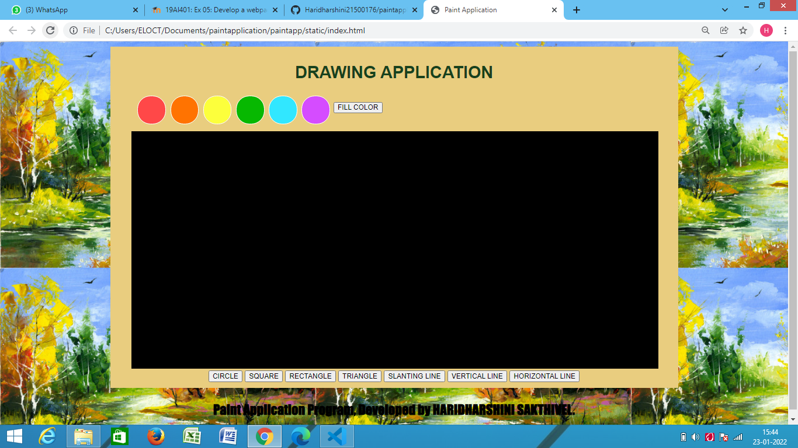
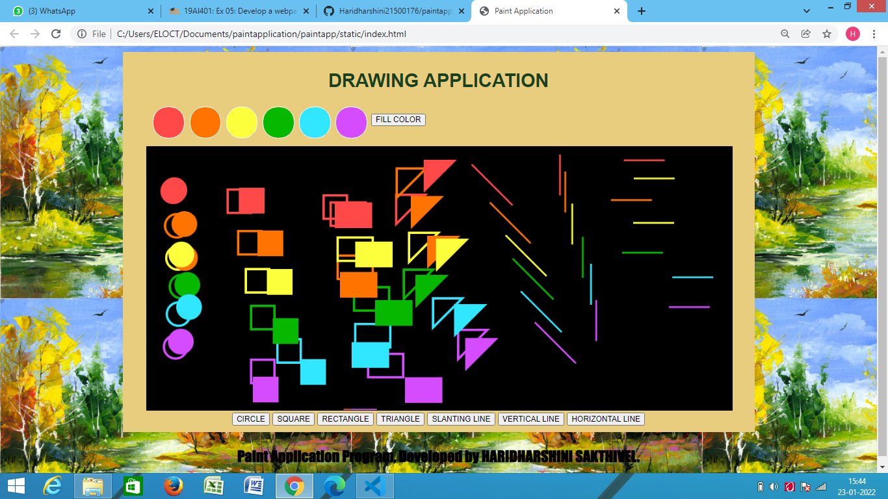

# Web Page for Paint Application

## AIM:

To design a static website for Paint Application using HTML5 canvas.

## DESIGN STEPS:

### Step 1:

Requirement collection.

### Step 2:

Creating the layout using HTML,CSS and canvas.

### Step 3:

Write javascript to capture move events.

### Step 4:

Perform the drawing operation based on the user input.

### Step 5:

Validate the layout in various browsers.

### Step 6:

Validate the HTML code.

### Step 6:

Publish the website in the given URL.

## PROGRAM :
```<!DOCTYPE html>
<html lang="en">
  <head>
    <meta charset="UTF-8" />
    <meta http-equiv="X-UA-Compatible" content="IE=edge" />
    <meta name="viewport" content="width=device-width, initial-scale=1.0" />
    <title>Paint Application</title>
    <style>
      * {
        box-sizing: border-box;
        font-family: Arial, Helvetica, sans-serif;
      }
      body {
        background-color:lightseagreen;
        color: #17421d;
        background-image: url(./painting.jpg);
      }
      .container {
        width: 1080px;
        margin-left: auto;
        margin-right: auto;
      }
      .content {
        display: block;
        width: 100%;
        background-color:rgb(233, 205, 127);
        min-height: 650px;
        margin: 10px 10px 0px 0px;
        padding-top: 10px;
      }
      h1 {
        text-align: center;
      }
      canvas {
        margin-left: 40px;
        margin-right: 40px;
        background-color: black;
      }
      .toolbar {
        text-align: center;
    
      }
      .toolbar1 {
        text-align: left;
        margin-left:50px;
        margin-bottom:10px;
      }

      #buttonstyle{
          background-color: #FDF5F5;
          border: 2px solid #EB7A81;
          border-radius: 5px;
          color: black;
          padding: 15px 32px;
          text-align: center;
          display: inline-block;
          font-size: 16px;
          margin: 4px 2px;
          cursor: pointer;
        }
        #buttonstyle:hover{
            background-color:#ffffff36;
            transition: 0.5s;
        }
        
        #shooky{
            border: 2px solid #ffffff;
            border-radius: 25px;
            padding: 25px 25px;
            text-align: center;
            display: inline-block;
            font-size: 16px;
            margin: 4px 2px;
            cursor: pointer;
        }
        #color1{
            border: 2px solid #ffffff;
            border-radius: 25px;
            padding: 25px 25px;
            text-align: center;
            display: inline-block;
            font-size: 16px;
            margin: 4px 2px;
            cursor: pointer;
        }    
        #color2{
            border: 2px solid #ffffff;
            border-radius: 25px;
            padding: 25px 25px;
            text-align: center;
            display: inline-block;
            font-size: 16px;
            margin: 4px 2px;
            cursor: pointer;
        }    
        #color3{
            border: 2px solid #ffffff;
            border-radius: 25px;
            padding: 25px 25px;
            text-align: center;
            display: inline-block;
            font-size: 16px;
            margin: 4px 2px;
            cursor: pointer;
        }
        #color4{
            border: 2px solid #ffffff;
            border-radius: 25px;
            padding: 25px 25px;
            text-align: center;
            display: inline-block;
            font-size: 16px;
            margin: 4px 2px;
            cursor: pointer;
        }
        #color5{
            border: 2px solid #ffffff;
            border-radius: 25px;
            padding: 25px 25px;
            text-align: center;
            display: inline-block;
            font-size: 16px;
            margin: 4px 2px;
            cursor: pointer;
        }    
        #color6{
            border: 2px solid #ffffff;
            border-radius: 25px;
            padding: 25px 25px;
            text-align: center;
            display: inline-block;
            font-size: 16px;
            margin: 4px 2px;
            cursor: pointer;
        }
        #color1:hover{
            opacity: 20%;
            transition: 0.21s;
        }
        #color2:hover{
            opacity: 20%;
            transition: 0.21s;
        } 
        #color3:hover{
            opacity: 20%;
            transition: 0.21s;
        }
         #color4:hover{
            opacity: 20%;
            transition: 0.21s;
        } 
        #color5:hover{
            opacity: 20%;
            transition: 0.21s;
        } 
        #color6:hover{
            opacity: 20%;
            transition: 0.21s;
        }

    </style>
    <script>
      var shape;
      var color;
      var fill;
      function myClickEvent(e){
        var message;
        //message="X="+e.offsetX+",Y="+e.offsetY;
        
        ctx.beginPath();
        if(shape==0){
          ctx.arc(e.offsetX,e.offsetY,20,0,2 * Math.PI);
          ctx.lineWidth=4;
          
        }if(shape==1){
          ctx.rect(e.offsetX, e.offsetY, 40,40);
          ctx.lineWidth=4;
        }if(shape==2){
          ctx.rect(e.offsetX,e.offsetY,60,40);
          ctx.lineWidth=4;
        }if(shape==3){
          ctx.moveTo(e.offsetX,e.offsetY);
          ctx.lineTo(e.offsetX+50,e.offsetY);
          ctx.lineTo(e.offsetX,e.offsetY+50);
          ctx.lineTo(e.offsetX,e.offsetY);
          ctx.lineTo(e.offsetX+50,e.offsetY);
          ctx.lineWidth=4;
        }if(shape==4){
          ctx.moveTo(e.offsetX,e.offsetY);
          ctx.lineTo(e.offsetX+70,e.offsetY+70);
          ctx.lineWidth=3;
        }if(shape==5){
          ctx.moveTo(e.offsetX,e.offsetY);
          ctx.lineTo(e.offsetX,e.offsetY+70);
          ctx.lineWidth=3;
        }else if(shape==6){
          ctx.moveTo(e.offsetX,e.offsetY);
          ctx.lineTo(e.offsetX+70,e.offsetY);
          ctx.lineWidth=3;
        }

        if(color==1){
          ctx.strokeStyle="rgb(255, 72, 72)";
          if (fill==1) {
            ctx.fillStyle="rgb(255, 72, 72)";
            ctx.fill();
          } 
        }if(color==2){
          ctx.strokeStyle="rgb(255, 115, 1)";
          if(fill==1){
            ctx.fillStyle="rgb(255, 115, 1)";
            ctx.fill();
          }
        }if(color==3){
          ctx.strokeStyle="rgb(252, 255, 60)";
          if(fill==1){
            ctx.fillStyle="rgb(252, 255, 60)";
            ctx.fill();
          }
        }if(color==4){
          ctx.strokeStyle="rgb(7, 184, 1)";
          if(fill==1){
            ctx.fillStyle="rgb(7, 184, 1)";
            ctx.fill();
          }
        }else if(color==5){
          ctx.strokeStyle="rgb(49, 231, 255)";
          if(fill==1){
            ctx.fillStyle="rgb(49, 231, 255)";
            ctx.fill();
          }
        }else if(color==6){
          ctx.strokeStyle="rgb(213, 76, 255)";
          if(fill==1){
            ctx.fillStyle="rgb(213, 76, 255)";
            ctx.fill();
          }
        }


        
        ctx.stroke();  
      }
      function circleClicked(){
        shape=0;
      }
      function squareClicked(){
        shape=1;
      }
      function rectangleClicked(){
        shape=2;
      }
      function triangleClicked(){
        shape=3;
      }
      function slineClicked(){
        shape=4;
      }
      function vlineClicked(){
        shape=5;
      }
      function hlineClicked(){
        shape=6;
      }
      function redClicked(){
        color=1;
      }
      function orangeClicked(){
        color=2;
      }
      function yellowClicked(){
        color=3;
      }
      function greenClicked(){
        color=4;
      }
      function blueClicked(){
        color=5;
      }
      function violetClicked(){
        color=6;
      }
      function colorClicked(){
        fill=1;
      }
    </script>
  </head>
  <body>
    <div class="container">
      <div class="content">
        <h1>DRAWING APPLICATION</h1>
        <div>
          <div class="toolbar1">

            <button onclick="change_color" id="color1" style="background: rgb(255, 72, 72);"></button>
            <button onclick="change_color" id="color2" style="background: rgb(255, 115, 1);"></button>
            <button onclick="change_color" id="color3" style="background: rgb(252, 255, 60);"></button>
            <button onclick="change_color" id="color4" style="background: rgb(7, 184, 1);"></button>
            <button onclick="change_color" id="color5" style="background: rgb(49, 231, 255);"></button>
            <button onclick="change_color" id="color6" style="background: rgb(213, 76, 255);"></button>
            <input type="button" id="fill" value="FILL COLOR" />
            
          </div>
          
        </div>

          <canvas
            id="myCanvas"
            width="1000"
            height="450"
            style="border: 1px solid #000000">
          
      </canvas>
      <div class="toolbar">
        <input type="button" id="circle" value="CIRCLE"/>
        <input type="button" id="square" value="SQUARE"/>
        <input type="button" id="rectangle" value="RECTANGLE"/>
        <input type="button" id="triangle" value="TRIANGLE"/>
        <input type="button" id="sline" value="SLANTING LINE"/>
        <input type="button" id="vline" value="VERTICAL LINE"/>
        <input type="button" id="hline" value="HORIZONTAL LINE"/>
        
      </div>
      </div>
    </div>
    <script>
      var c=document.getElementById("myCanvas");
      var ctx=c.getContext("2d");
      c.addEventListener("click", myClickEvent);
      document
        .getElementById("circle")
        .addEventListener("click", circleClicked);
      document
        .getElementById("square")
        .addEventListener("click", squareClicked);
      document
        .getElementById("rectangle")
        .addEventListener("click", rectangleClicked);
      document
        .getElementById("triangle")
        .addEventListener("click", triangleClicked);
      document
        .getElementById("sline")
        .addEventListener("click", slineClicked);
      document
        .getElementById("vline")
        .addEventListener("click", vlineClicked);
      document
        .getElementById("hline")
        .addEventListener("click", hlineClicked);
      document
        .getElementById("color1")
        .addEventListener("click", redClicked);
      document
        .getElementById("color2")
        .addEventListener("click", orangeClicked);  
      document
        .getElementById("color3")
        .addEventListener("click", yellowClicked); 
      document
        .getElementById("color4")
        .addEventListener("click", greenClicked);
      document
        .getElementById("color5")
        .addEventListener("click", blueClicked);
    document
        .getElementById("color6")
        .addEventListener("click", violetClicked);
      document
        .getElementById("fill")
        .addEventListener("click",colorClicked); 
    </script>
        <p style="font-family:Impact, Haettenschweiler, 'Arial Narrow Bold', sans-serif ; 
        text-align: center;
        color:#000000;
        font-size: 25px;
        font-weight: bolder;">Paint Application Program, Developed by HARIDHARSHINI SAKTHIVEL.</p>
  </body>
</html>
```
## OUTPUT:




## Result:

Thus a website is designed and validated for paint application using HTML5 canvas.
